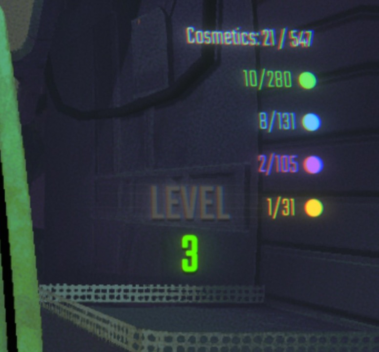
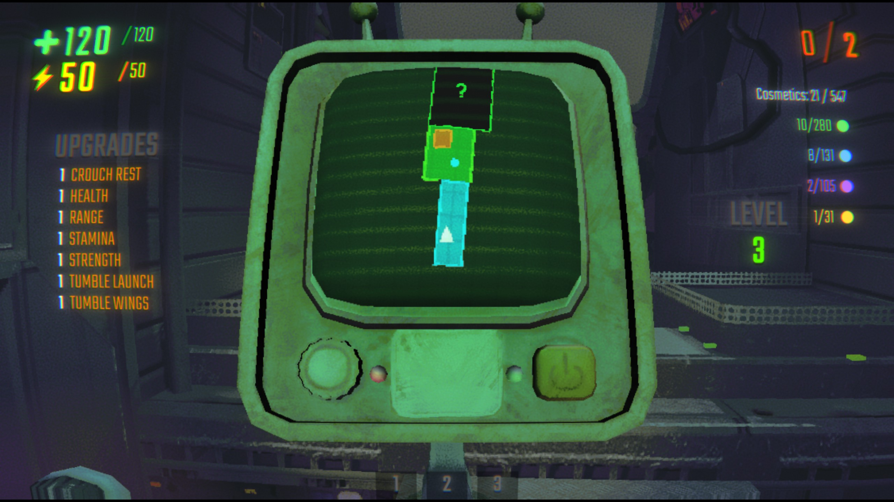

# REPO Cosmetics Display

This mod is QOL (quality of life) that is an additional element as an overlay.
Displays your unlocked cosmetics on the map screen, organized by rarity tier.

## Features

- Shows cosmetics count (unlocked / total)
- Color-coded by rarity: Common, Uncommon, Rare, Ultra Rare
- Appears in top-right corner when map is open
- Real-time updates every 2 seconds

## Usage

Open the map - cosmetics display will appear in the top-right corner automatically !

As you can see, it is discrete and fits in the game, using the same text and a good layout.

## Updates and versions

#### v1.0.0 :

Simple interface, all shown at the right side of the screen.

#### v1.0.1 :

Same interface, moved it on the top for better reading a cleaner aligning.
Thunderstore mod presentation updated.

#### v1.0.2 (most recent) :

Just fixing the thunderstore presentation. Adding illustrations. Updated Icon.

## FAQ

##### - Can I use this mod in multiplayer ?

Yes, it is a client side mod, meaning it only impacts you, and not the other players.

##### - Do I need to install plugins for it to work ?

The only plugin you need is included in the downloaded when downloaded from thunderstore app.
If not, you may need to install BepInEx (5.4.2304)

##### - Can I use this with other mods ?

Of course ! If you want it compatible with certain other mods, do not hesitate to contact us :)

##### - Can I include it in my modpack ?

Yes absolutely, we are happy that you like the mod !

## Note

We are still new to modding, if you encounter any bug, crash or lag due to it, please let us know :)

### Contact us / feedback

You can contact us at : caesarencodingfactor@gmail.com

Have fun !
